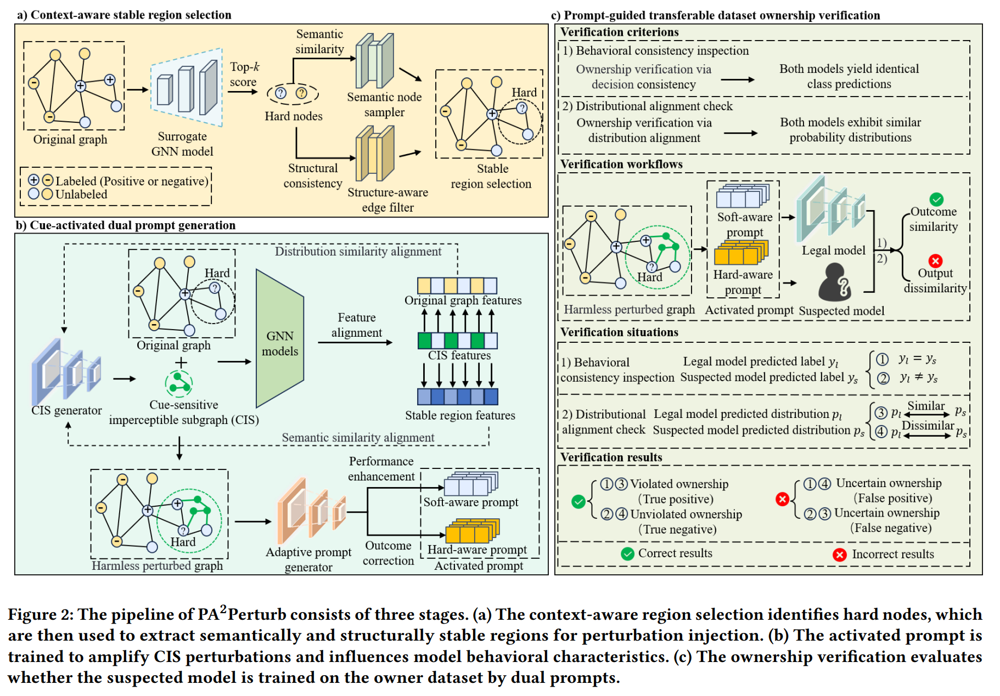

# PA2Perturb

## Project Introduction
PA2Perturb (Prompt-Activated Amplified Perturbation) is an innovative approach to address the critical issue of unauthorized dataset usage in the field of Graph Neural Networks (GNNs). As the demand for high-quality graph data increases, so does the risk of unauthorized use of datasets for training GNN models. This project introduces a novel method that allows dataset owners to verify the usage of their datasets while minimizing damage to both the dataset and the model performance.

Key aspects of PA2Perturb include:

1. **Stealthy Perturbations**: We use cue-sensitive imperceptible subgraphs to replace anomalous modifications, ensuring that perturbations are subject to semantic and distributional similarity constraints.

2. **Damage-Free Injection**: Our approach does not modify node labels and only uses prompts to activate latent patterns and manipulate model behaviors, minimizing potential damage to the dataset and model.

3. **Adaptive Amplification**: We utilize prompts to adaptively amplify perturbations, enhancing the transferability of our scheme across different scenarios.

4. **High Verification Accuracy**: Comprehensive experiments on various representative graph datasets demonstrate that PA2Perturb outperforms existing state-of-the-art baselines, achieving verification accuracy over 95.0%.

This project provides a comprehensive framework for researchers and practitioners to explore, implement, and evaluate PA2Perturb and other GNN-related techniques.

## Paper Abstract
The graph-structured datasets can be leveraged to pre-train representationally powerful graph neural networks (GNNs). However,
with the increasing demand for high-quality graph data, the utilization of unauthorized datasets for training GNN models is becoming
increasingly common, which seriously damages the interests of
dataset owners. Current ownership-preserving research has focused on validating unauthorized usage of unstructured datasets
through non-intrusive and intrusive methods. Non-intrusive methods rely on the inherent decision boundaries that fail to guarantee
the reliability of the results. Intrusive methods utilize perturbations
to validate dataset ownership but easily damage the performance
of the model due to intentional manipulations. To address these issues, we propose a novel prompt-activated amplified perturbation
from the perspective of damage-free injection, called PA2Perturb.
Specifically, to improve the stealthiness of perturbations, we utilize the cue-sensitive imperceptible subgraph to replace anomalous modifications, which is subject to semantic and distributional
similarity constraints. Subsequently, to minimize damage to the
dataset and model, our scheme does not modify node labels and
only utilizes prompts to activate latent patterns and manipulate
model behaviors. Eventually, to enhance the transferability of our
scheme, we utilize prompts to adaptively amplify perturbations
to accommodate different scenarios. Overall, the dataset owner is
allowed to check the usage of datasets by observing the behavioral characteristics of models during prompt-activated queries
to amplify perturbations. Comprehensive experiments on various
representative graph datasets demonstrate that our PA2Perturb
outperforms existing state-of-the-art baselines with the verification accuracy over 95.0%. Our source code is publicly available at
https://anonymous.4open.science/r/PA2Perturb-4F14

## Paper Framework



## Key Features
- Implementation of multiple state-of-the-art GNN models (GCN, GAT, GraphSAGE, etc.)
- Various adversarial attack method implementations (including structural and feature attacks)
- Integration of multiple defense strategies, such as graph purification and adversarial training
- Flexible evaluation framework supporting custom attack and defense methods
- Support for multiple standard graph datasets (Cora, Citeseer, PubMed, etc.)
- Detailed logging and visualization tools for result analysis

## Dependencies
This project relies on the following main libraries:
- Python 3.8+
- PyTorch 1.9+
- PyTorch Geometric 2.0+
- NetworkX 2.6+
- NumPy 1.20+
- Matplotlib 3.4+
- tqdm 4.60+

You can install the dependencies using the following command:
```
pip install -r requirements.txt
```

## Usage Instructions
1. Clone the repository:
   ```
   git clone https://github.com/your-username/PA2Perturb.git
   cd PA2Perturb
   ```

2. Install dependencies:
   ```
   pip install -r requirements.txt
   ```

3. Run experiments:
   ```
   python ours.py --model gcn --attack pgd --defense adversarial_training --dataset cora
   ```

   Parameter description:
   - `--model`: Choose GNN model (gcn, gat, graphsage)
   - `--attack`: Choose attack method (pgd, fgsm, random)
   - `--defense`: Choose defense method (adversarial_training, graph_purification)
   - `--dataset`: Choose dataset (cora, citeseer, pubmed)

This will generate comparative charts for accuracy, robustness, and computation time.

## Project Structure
- `ours.py`: Main entry file for the project
- `model/`: Contains various GNN model implementations
- `baseline_attack/`: Contains baseline attack methods
- `evaluation/`: Contains evaluation scripts
- `data/`: Data processing and loading scripts
- `utils/`: Auxiliary functions and tools


## Contributing
We welcome and appreciate all forms of contribution! If you'd like to contribute to PA2Perturb, please follow these steps:

1. Fork the repository
2. Create your feature branch (`git checkout -b feature/AmazingFeature`)
3. Commit your changes (`git commit -m 'Add some AmazingFeature'`)
4. Push to the branch (`git push origin feature/AmazingFeature`)
5. Open a Pull Request

For major changes, please open an issue first to discuss what you would like to change.

## License
This project is licensed under the MIT License. See the [LICENSE](LICENSE) file for details.

## Contact Us
If you have any questions or suggestions, please contact us:
- Email: yo***@example.com
- GitHub Issues: https://github.com/your-username/PA2Perturb/issues

We look forward to your feedback and contributions!
